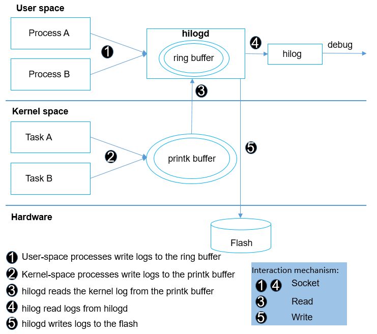

# HiLog<a name="EN-US_TOPIC_0000001115694144"></a>

-   [Introduction](#section11660541593)
-   [Directory Structure](#section161941989596)
-   [Constraints](#section119744591305)
-   [Usage](#section06487425716)
    -   [Available APIs](#section1551164914237)
    -   [Usage Guidelines](#section129654513264)

-   [Repositories Involved](#section177639411669)

## Introduction<a name="section11660541593"></a>

HiLog is the module of OpenHarmony that logs information such as user operations and system running status for the system framework, services, and applications. 

**Figure  1**  Architecture of the HiLog module<a name="fig4460722185514"></a>  




User-space processes write logs to the ring buffer of hilogd through the log API. hilogd sends logs to the console for viewing or writes logs to the flash at the request of the hilog.

The details are as follows:

-   **hilogd**: log service in the user space

1.  hilogd is a resident service and is enabled by default when the system is started.
2.  User-space processes call the log APIs to transfer the formatted log content to hilogd and store the content in its ring buffer.

-   **hilog**: command line tool for viewing logs

1.  hilog reads the log content from the ring buffer of hilogd, filters the content if required, and then prints the content to the standard output.

Supported functions:

-   Formatting of parameter privacy identifiers \(See the following example for details.\)
-   Flow control on excess log processes
-   Flow control on excess domains \(subsystems or modules\) involved in log printing
-   Log compression and flushing

## Directory Structure<a name="section161941989596"></a>

```
/base/hiviewdfx/hilog
├── frameworks           # Framework code
│   └── native          # HiLog Native implementation code
├── interfaces           # APIs
│   └── native          # External C/C++ APIs
│       └── innerkits   # Header files opened to internal subsystems
│       └── kits        # Header files opened to applications
├── services
│   └── hilogd          # HiLog resident service implementation
│   └── hilogtool       # HiLog tool implementation
```

## Constraints<a name="section119744591305"></a>

Clang 8.0.0 or later is required.

## Usage<a name="section06487425716"></a>

### Available APIs<a name="section1551164914237"></a>

**Table  1**  Major APIs of HiLog

<a name="table5489165165714"></a>
<table><thead align="left"><tr id="row12490195195718"><th class="cellrowborder" valign="top" width="14.09%" id="mcps1.2.4.1.1"><p id="p862411212488"><a name="p862411212488"></a><a name="p862411212488"></a><strong id="b68190161218"><a name="b68190161218"></a><a name="b68190161218"></a>Class</strong></p>
</th>
<th class="cellrowborder" valign="top" width="33.98%" id="mcps1.2.4.1.2"><p id="p10859172921116"><a name="p10859172921116"></a><a name="p10859172921116"></a>Method</p>
</th>
<th class="cellrowborder" valign="top" width="51.93%" id="mcps1.2.4.1.3"><p id="p104901150576"><a name="p104901150576"></a><a name="p104901150576"></a>Description</p>
</th>
</tr>
</thead>
<tbody><tr id="row34901758577"><td class="cellrowborder" valign="top" width="14.09%" headers="mcps1.2.4.1.1 "><p id="p16501115918497"><a name="p16501115918497"></a><a name="p16501115918497"></a>HiLogLabel</p>
</td>
<td class="cellrowborder" valign="top" width="33.98%" headers="mcps1.2.4.1.2 "><p id="p1550175974917"><a name="p1550175974917"></a><a name="p1550175974917"></a>HiLogLabel(int type, int domain, String tag)</p>
</td>
<td class="cellrowborder" valign="top" width="51.93%" headers="mcps1.2.4.1.3 "><p id="p135021859104915"><a name="p135021859104915"></a><a name="p135021859104915"></a>Constructs a log label, including the log type, domain, and tag.</p>
</td>
</tr>
<tr id="row868117162916"><td class="cellrowborder" valign="top" width="14.09%" headers="mcps1.2.4.1.1 "><p id="p1215914385013"><a name="p1215914385013"></a><a name="p1215914385013"></a>HiLog</p>
</td>
<td class="cellrowborder" valign="top" width="33.98%" headers="mcps1.2.4.1.2 "><p id="p1415914345011"><a name="p1415914345011"></a><a name="p1415914345011"></a>Info(const HiLogLabel &amp;label, const char *fmt, ...)</p>
</td>
<td class="cellrowborder" valign="top" width="51.93%" headers="mcps1.2.4.1.3 "><p id="p1274814305510"><a name="p1274814305510"></a><a name="p1274814305510"></a>Prints logs of the info level.</p>
</td>
</tr>
</tbody>
</table>

### Usage Guidelines<a name="section129654513264"></a>

1. View logs.

Run the  **hilog | grep "MY\_TAG"**  command in shell mode.

```
Output in debug mode:
01-26 11:01:06.870 1051 1051 W 00201/test: Failed to visit [https://gitee.com/openharmony](https://gitee.com/openharmony), reason:503.
Output in release mode:
01-26 11:01:06.870 1051 1051 W 00201/test: Failed to visit <private>, reason:503.
```

## Repositories Involved<a name="section177639411669"></a>

[DFX subsystem](https://gitee.com/openharmony/docs/blob/master/en/readme/dfx.md)

[hiviewdfx\_hiview](https://gitee.com/openharmony/hiviewdfx_hiview/blob/master/README.md)

**hiviewdfx\_hilog**

[hiviewdfx\_hiappevent](https://gitee.com/openharmony/hiviewdfx_hiappevent/blob/master/README.md)

[hiviewdfx\_hisysevent](https://gitee.com/openharmony/hiviewdfx_hisysevent/blob/master/README.md)

[hiviewdfx\_faultloggerd](https://gitee.com/openharmony/hiviewdfx_faultloggerd/blob/master/README.md)

[hiviewdfx\_hilog\_lite](https://gitee.com/openharmony/hiviewdfx_hilog_lite/blob/master/README.md)

[hiviewdfx\_hievent\_lite](https://gitee.com/openharmony/hiviewdfx_hievent_lite/blob/master/README.md)

[hiviewdfx\_hiview\_lite](https://gitee.com/openharmony/hiviewdfx_hiview_lite/blob/master/README.md)

