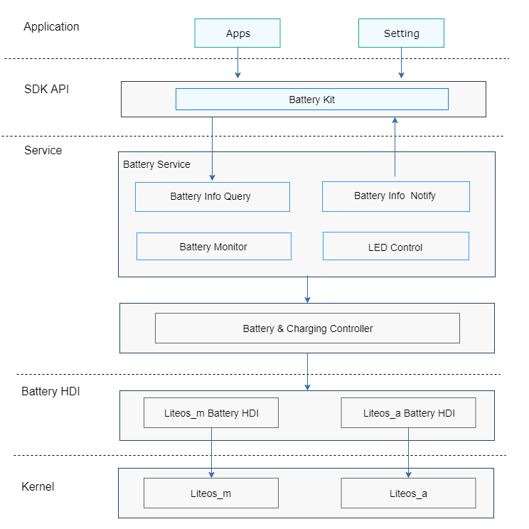

# Lite Battery Manager<a name="EN-US_TOPIC_0000001174637973"></a>

-   [Introduction](#section11660541593)
-   [Directory Structure](#section19472752217)
-   [Usage](#section146636391856)
    -   [Available APIs](#section481251394)
    -   [Usage Guidelines](#section12620311012)

-   [Repositories Involved](#section63151229062)

## Introduction<a name="section11660541593"></a>

The lite battery manager provides the following functionalities:

1.  Obtaining battery information
2.  Obtaining the battery charging status and the battery state of charge \(SoC\)
3.  Monitoring the battery state of health \(SoH\)
4.  Controlling the battery charging indicator

**Figure  1**  Lite battery manager architecture<a name="fig106301571239"></a>




## Directory Structure<a name="section19472752217"></a>

```
base/powermgr/battery_lite
├── frameworks        # Frameworks
│   ├── include       # Header files
│   └── src           # Source files
├── interfaces        # APIs
│   ├── innerkits     # Internal APIs
│   └── kits          # External APIs
├── services          # Services
│   ├── include       # Header files
│   └── src           # Source files
```

## Usage<a name="section146636391856"></a>

### Available APIs<a name="section481251394"></a>

The following table lists the JavaScript APIs provided by the lite battery manager.

<a name="table45171237103112"></a>

<table><thead align="left"><tr id="row12572123793117"><th class="cellrowborder" valign="top" width="38.71%" id="mcps1.1.3.1.1"><p id="p19572937163116"><a name="p19572937163116"></a><a name="p19572937163116"></a><strong id="b1783175664017"><a name="b1783175664017"></a><a name="b1783175664017"></a>API</strong></p>
</th>
<th class="cellrowborder" valign="top" width="61.29%" id="mcps1.1.3.1.2"><p id="p157213711313"><a name="p157213711313"></a><a name="p157213711313"></a><strong id="b62896374115"><a name="b62896374115"></a><a name="b62896374115"></a>Description</strong></p>
</th>
</tr>
</thead>
<tbody><tr id="row14574143723119"><td class="cellrowborder" valign="top" width="38.71%" headers="mcps1.1.3.1.1 "><p id="p169098161437"><a name="p169098161437"></a><a name="p169098161437"></a>int32_t GetBatSoc()</p>
</td>
<td class="cellrowborder" valign="top" width="61.29%" headers="mcps1.1.3.1.2 "><p id="p105741337153115"><a name="p105741337153115"></a><a name="p105741337153115"></a>Obtains the battery SoC.</p>
</td>
</tr>
<tr id="row19195203919318"><td class="cellrowborder" valign="top" width="38.71%" headers="mcps1.1.3.1.1 "><p id="p46911925104319"><a name="p46911925104319"></a><a name="p46911925104319"></a>BatteryChargeState GetChargingStatus()</p>
</td>
<td class="cellrowborder" valign="top" width="61.29%" headers="mcps1.1.3.1.2 "><p id="p1619618397312"><a name="p1619618397312"></a><a name="p1619618397312"></a>Obtains the current battery charging status.</p>
</td>
</tr>
<tr id="row9397121153216"><td class="cellrowborder" valign="top" width="38.71%" headers="mcps1.1.3.1.1 "><p id="p1339731103216"><a name="p1339731103216"></a><a name="p1339731103216"></a>BatteryHealthState GetHealthStatus()</p>
</td>
<td class="cellrowborder" valign="top" width="61.29%" headers="mcps1.1.3.1.2 "><p id="p113972183214"><a name="p113972183214"></a><a name="p113972183214"></a>Obtains the battery SoH.</p>
</td>
</tr>
<tr id="row1721311920324"><td class="cellrowborder" valign="top" width="38.71%" headers="mcps1.1.3.1.1 "><p id="p321412915320"><a name="p321412915320"></a><a name="p321412915320"></a>BatteryPluggedType GetPluggedType()</p>
</td>
<td class="cellrowborder" valign="top" width="61.29%" headers="mcps1.1.3.1.2 "><p id="p32141298323"><a name="p32141298323"></a><a name="p32141298323"></a>Obtains the charger type.</p>
</td>
</tr>
<tr id="row269082112447"><td class="cellrowborder" valign="top" width="38.71%" headers="mcps1.1.3.1.1 "><p id="p16690202119449"><a name="p16690202119449"></a><a name="p16690202119449"></a>int32_t GetBatVoltage()</p>
</td>
<td class="cellrowborder" valign="top" width="61.29%" headers="mcps1.1.3.1.2 "><p id="p1869014214445"><a name="p1869014214445"></a><a name="p1869014214445"></a>Obtains the battery voltage.</p>
</td>
</tr>
<tr id="row3654173318447"><td class="cellrowborder" valign="top" width="38.71%" headers="mcps1.1.3.1.1 "><p id="p11654173374412"><a name="p11654173374412"></a><a name="p11654173374412"></a>bool IsBatPresent()</p>
</td>
<td class="cellrowborder" valign="top" width="61.29%" headers="mcps1.1.3.1.2 "><p id="p13654123354416"><a name="p13654123354416"></a><a name="p13654123354416"></a>Checks whether the battery is present.</p>
</td>
</tr>
<tr id="row12187141584413"><td class="cellrowborder" valign="top" width="38.71%" headers="mcps1.1.3.1.1 "><p id="p718841504418"><a name="p718841504418"></a><a name="p718841504418"></a>char* GetBatTechnology()</p>
</td>
<td class="cellrowborder" valign="top" width="61.29%" headers="mcps1.1.3.1.2 "><p id="p181881615194414"><a name="p181881615194414"></a><a name="p181881615194414"></a>Obtains the battery model.</p>
</td>
</tr>
<tr id="row18381310134520"><td class="cellrowborder" valign="top" width="38.71%" headers="mcps1.1.3.1.1 "><p id="p18838610114516"><a name="p18838610114516"></a><a name="p18838610114516"></a>int32_t GetBatTemperature()</p>
</td>
<td class="cellrowborder" valign="top" width="61.29%" headers="mcps1.1.3.1.2 "><p id="p13838121064515"><a name="p13838121064515"></a><a name="p13838121064515"></a>Obtains the battery temperature.</p>
</td>
</tr>
</tbody>
</table>


### Usage Guidelines<a name="section12620311012"></a>

The lite battery manager provides APIs for obtaining the battery SoC, battery charging status, and battery SoH.

The sample code is as follows:

```
int32_t capacity = GetBatSoc();
BatteryChargeState chargState = GetChargingStatus();
```

## Repositories Involved<a name="section63151229062"></a>

[Power management subsystem](https://gitee.com/openharmony/docs/blob/master/en/readme/power-management.md)

**powermgr_powermgr_lite**
