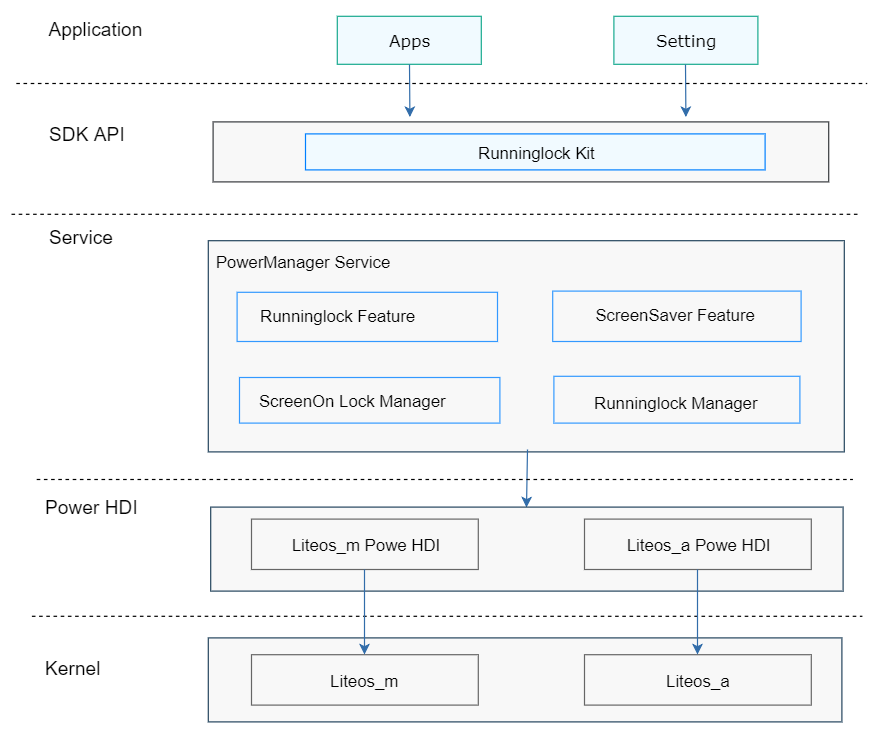

# Lite Power Manager<a name="EN-US_TOPIC_0000001126247025"></a>

-   [Introduction](#section11660541593)
-   [Directory Structure](#section19472752217)
-   [Usage](#section146636391856)
    -   [Available APIs](#section481251394)
    -   [Usage Guidelines](#section12620311012)

-   [Repositories Involved](#section63151229062)

## Introduction<a name="section11660541593"></a>

The lite power manager provides the following capabilities:

1.  Managing sleep and wakeup locks.
2.  Keeping the device screen always on using a lock

**Figure  1**  Lite power manager architecture<a name="fig106301571239"></a>  




## Directory Structure<a name="section19472752217"></a>

```
base/powermgr/powermgr_lite
├── frameworks        # Frameworks
│   ├── include       # Header files
│   └── src           # Source files
├── interfaces        # APIs
│   ├── innerkits     # Internal APIs
│   └── kits          # External APIs
├── services          # Services
│   ├── include       # Header files
│   └── src           # Source files
└── utils             # Utilities
    ├── include       # Header files
    └── src           # Source files
```

## Usage<a name="section146636391856"></a>

### Available APIs<a name="section481251394"></a>

The following table lists the JavaScript APIs provided by the lite power manager.

<a name="table45171237103112"></a>
<table><thead align="left"><tr id="row12572123793117"><th class="cellrowborder" valign="top" width="38.71%" id="mcps1.1.3.1.1"><p id="p19572937163116"><a name="p19572937163116"></a><a name="p19572937163116"></a><strong id="b98969616388"><a name="b98969616388"></a><a name="b98969616388"></a>API</strong></p>
</th>
<th class="cellrowborder" valign="top" width="61.29%" id="mcps1.1.3.1.2"><p id="p157213711313"><a name="p157213711313"></a><a name="p157213711313"></a><strong id="b17930187133810"><a name="b17930187133810"></a><a name="b17930187133810"></a>Description</strong></p>
</th>
</tr>
</thead>
<tbody><tr id="row14574143723119"><td class="cellrowborder" valign="top" width="38.71%" headers="mcps1.1.3.1.1 "><p id="p67351028124111"><a name="p67351028124111"></a><a name="p67351028124111"></a>RunningLock *CreateRunningLock(const char *name, RunningLockType type, RunningLockFlag flag)</p>
</td>
<td class="cellrowborder" valign="top" width="61.29%" headers="mcps1.1.3.1.2 "><p id="p105741337153115"><a name="p105741337153115"></a><a name="p105741337153115"></a>Creates a <strong id="b175677317248"><a name="b175677317248"></a><a name="b175677317248"></a>Runninglock</strong> object.</p>
</td>
</tr>
<tr id="row19195203919318"><td class="cellrowborder" valign="top" width="38.71%" headers="mcps1.1.3.1.1 "><p id="p219643914313"><a name="p219643914313"></a><a name="p219643914313"></a>void DestroyRunningLock(const RunningLock *lock)</p>
</td>
<td class="cellrowborder" valign="top" width="61.29%" headers="mcps1.1.3.1.2 "><p id="p1619618397312"><a name="p1619618397312"></a><a name="p1619618397312"></a>Destroys an <strong id="b1383113383249"><a name="b1383113383249"></a><a name="b1383113383249"></a>Runninglock</strong> object.</p>
</td>
</tr>
<tr id="row9397121153216"><td class="cellrowborder" valign="top" width="38.71%" headers="mcps1.1.3.1.1 "><p id="p1339731103216"><a name="p1339731103216"></a><a name="p1339731103216"></a>BOOL AcquireRunningLock(const RunningLock *lock)</p>
</td>
<td class="cellrowborder" valign="top" width="61.29%" headers="mcps1.1.3.1.2 "><p id="p113972183214"><a name="p113972183214"></a><a name="p113972183214"></a>Obtains a <strong id="b7678195622413"><a name="b7678195622413"></a><a name="b7678195622413"></a>Runninglock</strong> object.</p>
</td>
</tr>
<tr id="row1721311920324"><td class="cellrowborder" valign="top" width="38.71%" headers="mcps1.1.3.1.1 "><p id="p321412915320"><a name="p321412915320"></a><a name="p321412915320"></a>BOOL ReleaseRunningLock(const RunningLock *lock)</p>
</td>
<td class="cellrowborder" valign="top" width="61.29%" headers="mcps1.1.3.1.2 "><p id="p32141298323"><a name="p32141298323"></a><a name="p32141298323"></a>Releases a <strong id="b33588942512"><a name="b33588942512"></a><a name="b33588942512"></a>Runninglock</strong> object.</p>
</td>
</tr>
</tbody>
</table>

### Usage Guidelines<a name="section12620311012"></a>

**Runninglock Management**

The lite power manager provides APIs to create, obtain, and release  **Runninglock**  objects.

The sample code is as follows:

```
const RunningLock *lock = CreateRunningLock("runinglock_example", RUNNINGLOCK_BACKGROUND, RUNNINGLOCK_FLAG_NONE);
if (lock == NULL) {
   return;
}
BOOL ret = AcquireRunningLock(lock);
if (ret == FLASE) {
   DestroyRunningLock(lock);
   return;
}
ReleaseRunningLock(lock);
DestroyRunningLock(lock); // Must release runninglock before destroyed
```

## Repositories Involved<a name="section63151229062"></a>

[Power management subsystem](https://gitee.com/openharmony/docs/blob/master/en/readme/power-management.md)

**powermgr_powermgr_lite** 

